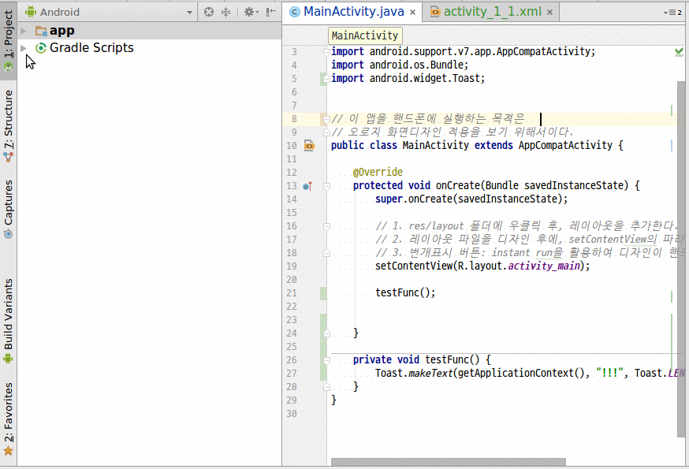

# Android Studio에서 java 실행  
> Android Studio에서 java를 실행할 수 있다. 단지 심하게 느릴 뿐이다. 
심하게 느린 이유는 필드툴인 Gradle 때문인데, Gradle은 App을 만들기 위한 자동툴이므로 java만 컴파일하지 않고 모든 작업을 수행하기 때문이다. Gradle 설정을 바꾸면 빨라질 수도 있겠으나, 그렇게 하면 주객이 전도되는 상황이 될 듯해서 느리게 사용하도록 한다.  

목적:
- Android Studio에서 순수 java 예제만 돌려본다. 

순서:
1. **java/순수자바트레이닝/세째날/출근** 을 더블클릭한다.
2. main 메소드가 있다면  실행버튼이 에디터에 보인다.
3. 실행이나 디버그 버튼을 눌러 코드를 실행한다. 
4. 이렇게 하면 빌드설정이 java 파일로 선택되어 있다. 나중에 안드로이드앱을 빌드하려면 모드를 [app]으로 설정해야 한다. 

